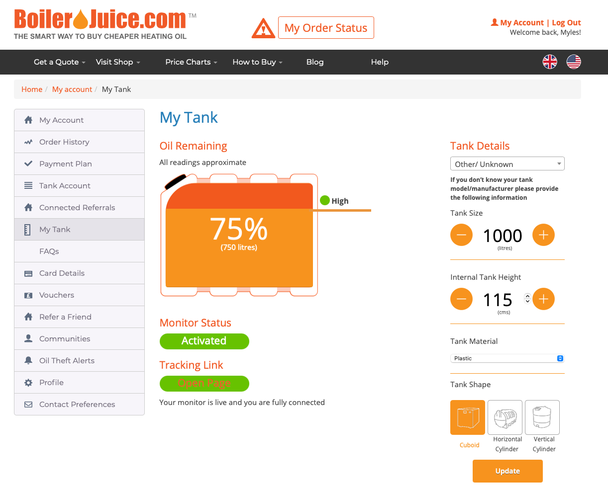

# Boilerjuice Scraping API

## Intro

Boilerjuice.com has no public API, and pages are rendered via PHP with data pre-baked, as a result - to get information back from the site about your Oil Tank's current level you need to auth with the site and scrape the data back from the web pages.

That is what this project does.

## Function

Example input page:



Example API output:

```json
{
  "capacity":"1055",
  "litres":750.0,
  "percent":"70",
  "total_litres":950.0,
  "total_percent":"90"
}
```

## Run

Run the API:

```sh
docker run -d -p 8080:8080 -e BJ_USERNAME=my@emailaddress.com -e BJ_PASSWORD=password ghcr.io/mylesagray/boilerjuice-tank
```

Docker images are available on DockerHub or GitHub Container Registry:

```sh
ghcr.io/mylesagray/boilerjuice-tank
mylesagray/boilerjuice-tank
```

## Use

Access the API:

```sh
open http://localhost:8080
```

Access Prometheus scraping endpoint:

```sh
open http://localhost:8080/metrics
```

## Build

Build multiarch image:

```sh
docker buildx create --use
docker buildx build --platform linux/arm64,linux/amd64 -t mylesagray/boilerjuice-tank:v0.2 -t mylesagray/boilerjuice-tank -t ghcr.io/mylesagray/boilerjuice-tank:v0.2 -t ghcr.io/mylesagray/boilerjuice-tank --push .
```
